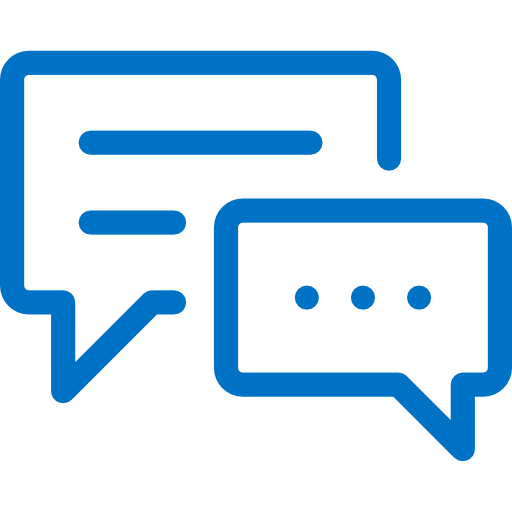

<p align="center">
  <a href="" rel="noopener">
 </a>
</p>

<h3 align="center">A live chat with Websocket</h3>

<div align="center">

[]()

</div>

---

## 📝 Table of Contents

-   [About](#about)
-   [Structures](#structures)
-   [Getting Started](#getting_started)
-   [Built Using](#built_using)
-   [Authors](#authors)

## 🧐 About <a name = "about"></a>

This project it's about developing skills using Websocket.io and basic HTML and CSS, creating a live chat using ExpressJS as a framework.

## 📁 Structures <a name="structures"></a>

### This is how the Project is structured.

```
app/
├─ node_modules/
├─ public/
│  └─ index.html
│  └─ styles.css
├─ .gitignore
├─ .prettierrc
├─ package.json
├─ README.md
└─ yarn.lock
```

## 🏁 Getting Started <a name = "getting_started"></a>

These instructions will get you a copy of the project up and running on your local machine for development and testing purposes.

### Prerequisites & Installing

What packages do you need to install the software.

```
-NodeJS
  "ejs": "^3.1.8",
  "express": "^4.18.1",
  "socket.io": "^4.5.2"
```

### Runing & Usage

A step by step series of examples that tell you how to get a development env running.

Running the project with the command line

```
yarn start or node src/index.js
```

## ⛏️ Built Using <a name = "built_using"></a>

-   [NodeJS](https://nodejs.org/en/) - NodeJS
-   [ExpressJS](https://expressjs.com/) - ExpressJS

## ✍️ Authors <a name = "authors"></a>

-   [@joaorjoaquim](https://github.com/joaorjoaquim) - Idea & Initial work
